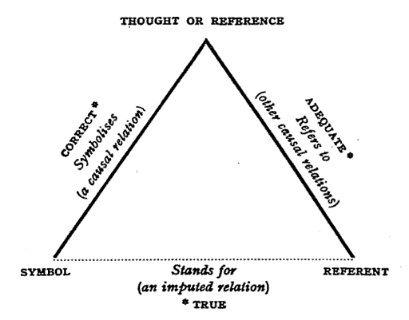

# Enguage - Basic Principles

Enguage attempts to reflect the conventional mapping of words uttered to those replied.
This convention described in "The Meaning of Meaning",
but is based on the idea that we also think in utterances,
and it is directed by our reaction to those thoughts.

[c/f. "This Meaning of Meaning", Ogden and Richards, 1932, pp11]

utterance --> {thoughts|references} --> {replies}  
------ felicity ------->

## Terminology:
**Utterance** -- 
Symbols, thoughts and referent objects (replies) are all merely utterances.
An utterance is just any string of words, there is no need for it to conform to any syntax.
Enguage performs this arbtrary mapping initiated by utteranes.

**Thought** --
Thoughts are unspoken utterances, used to interpret utterances, and are 
interpreted themsleves.

**Reference** --
References refer to further unspoken utterances, 

**Reply** --
A reply is a formatted answer. A different reply (format) will be provided
at each level of interpretation.

**Answer** --
An answer is a (list of) data items will be passed back, verbatim, through the layers  of thought.

**Felicity** --
Underlying the interpretation of thoughts is the felicity, or happiness, of their reply. 
This is by which we create conditional processing during speech.
If a reply is infelicitous, interpretation proceeds on the thoughts that are preceded with "if not, ";
felicitous replies can be, but are not necessarily, prefixed by "if so, ...".

## Acknowledgements:
+ U-T-R: is essentially the Triadic Sign model, of Sign, Object and Interpretant
by Charles Sanders Peirce (1839-1914), as illustrated by C. K. Ogden and 
I. A. Richards in their 1923 book, "The Meaning of Meaning".

+ Felicity - was introduced by John Langshaw Austin, in his 1955 
William James Lectures at Harvard. 
This was taken up and advances as Speech Act Theory by John Searle.

## Papers
+ 2007 - Semiotic Distance - describing the 'depth' of understanding.
+ 2011 - Semiotc Model of IS - a conversational model if information systems.
+ 2013 - If we are holding hands... - the first comprehensive example.
+ 2014 - Autopoietic Repertoire - how to self-generate information systems.
+ 2016 - Disambiguation - a vocal mechanism.
+ 2018 - Programming without Program - Vocal programming.
+ 2018 - Because and Why - Advanced example of vocal reasoning.
+ 2019 - Pronoun disabmiguation - Winograd Schema Challenge example.

Plus many more available on [ReserchGate.org](https://www.researchgate.net/profile/Martin_Wheatman)

